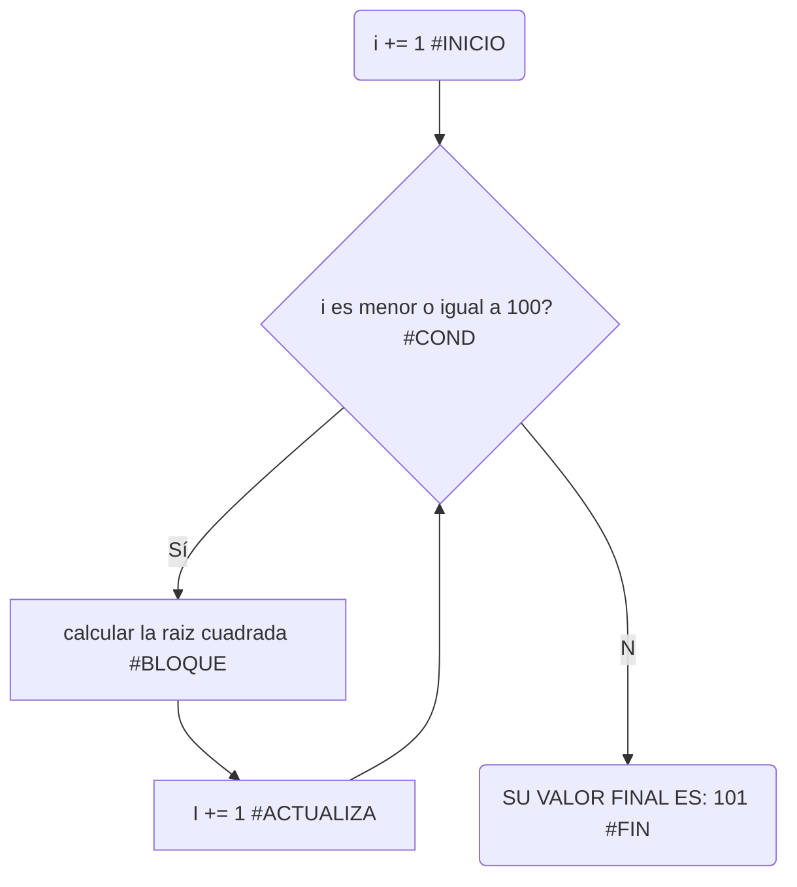

# RETO_7_UN_VIAJE_ASTRAL

## BUCLES 1

1. Imprimir un listado con los números del 1 al 100 cada uno con su respectivo cuadrado.

```pseudocode
i: int = 1 #<inicia>
print("el valor de i antes del ciclo: " + str(i))
while(i <= 100): #<cond>
    cuadrado = i ** 2 #<bloque>
    print("el valor dentro del cilo: " + str(i)+ "y su cuadrado: " + str(cuadrado))
    i += 1 #<actualizada>
print("valor final de i: " + str(i))
```

[](https://postimg.cc/XpJx3vSy)



2. Imprimir un listado con los números impares desde 1 hasta 999 y seguidamente otro listado con los números pares desde 2 hasta 1000.
