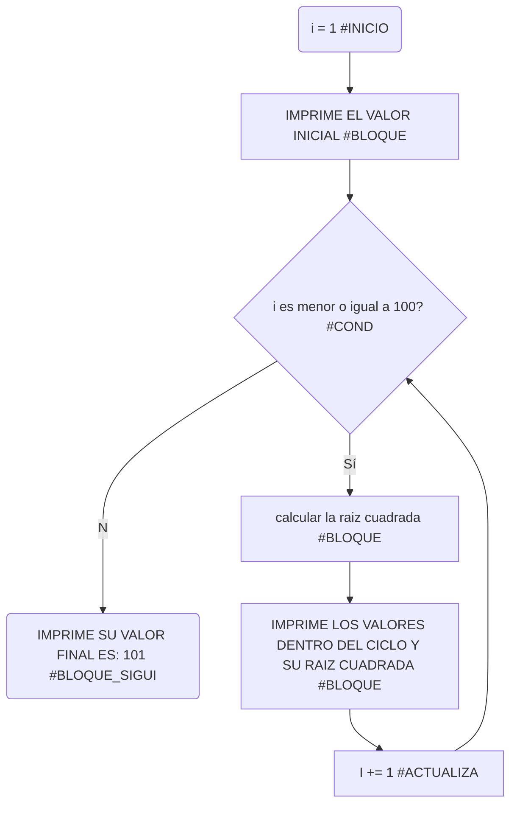
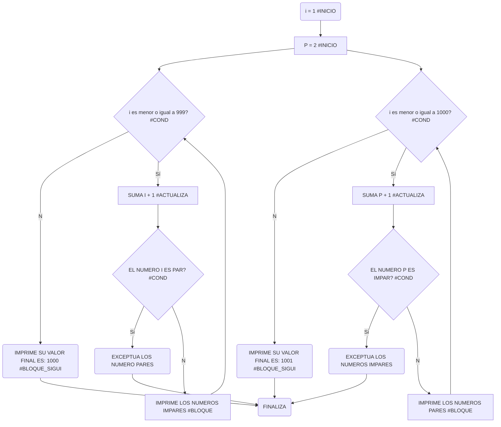
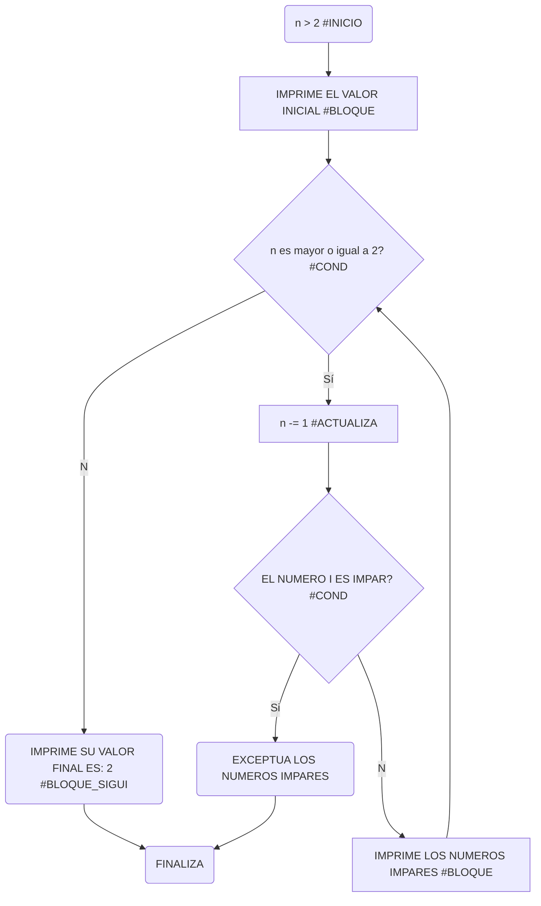

# RETO_7_UN_VIAJE_ASTRAL

## BUCLES 1

1. Imprimir un listado con los números del 1 al 100 cada uno con su respectivo cuadrado.

```pseudocode
i: int = 1 #<inicia>
print("el valor de i antes del ciclo: " + str(i))
while(i <= 100): #<cond>
    cuadrado = i ** 2 #<bloque>
    print("el valor dentro del ciclo: " + str(i)+ "y su cuadrado: " + str(cuadrado))
    i += 1 #<actualizada>
print("valor final de i: " + str(i))
```

[](https://postimg.cc/XpJx3vSy)



2. Imprimir un listado con los números impares desde 1 hasta 999 y seguidamente otro listado con los números pares desde 2 hasta 1000.

```pseudocode
i:int = 1 #<inicia> inicia el listado de los numeros impares
print("el valor i antes del ciclo: " + str(i)) #<bloque> imprime el valor inicial de i 
p:int = 2 #<inicia> inicia el listado de los numeros pares
print("el valor p antes del ciclo: " + str(p)) #<bloque> imprime el valor inicial de i
while (i <= 999):  #<cond> se repiten los numeros que sean menores o iguales a 999
    i += 1 #<actualiza> suma i + 1     
    if i%2 == 0: #<bloque> exceptua los numero pares
        continue
    print("el valor i en el ciclo es: " + str(i)) #<bloque> imprime el valor de i
while (p <= 1000): #<cond> se repiten los numeros que sean menores o iguales a 1000
    p += 1 #<actualiza> suma p + 1 
    if p%2 != 0: #<bloque> exceptua los numero impares
        continue
    print("el valor en el ciclo es: " + str(p)) #<bloque> imprime el valor de p

```
[](https://postimg.cc/9rmgPS05)


3. Imprimir los números pares en forma descendente hasta 2 que son menores o iguales a un número natural n ≥ 2 dado

```pseudocode
n = int(input("ingrese una numero natural mayor o igual a 2: ")) #<inicia> el usuario declara el numero
print("el valor del numero antes del ciclo es: " + str(n)) #<bloque> se imprime el numero que el usuario declaro
while (n >= 2): #<cond> el numero n tiene que ser mayor o igual a 2
    n -= 1 #<actualiza>  va restando el numero n - 1
    if n%2 != 0: #<bloque> exceptua todos los que son impares
        continue
    print("el valor en el ciclo es: " + str(n)) #<bloque> imprime el valor en el ciclo 
```

[](https://postimg.cc/njC7Gc1s)



4. En 2022 el país A tendrá una población de 25 millones de habitantes y el país B de 18.9 millones. Las tasas de crecimiento anual de la población serán de 2% y 3% respectivamente. Desarrollar un algoritmo para informar en que año la población del país B superará a la de A.

```pseudocode
# DECLARO LAS VARIABLES
a:float = 25 #<bloque> declaro los habitantes de a en millones
b:float = 18.9 #<bloque> declaro los habitantes de a en millones
tasa_crecimiento_a:float = 0.02 #<bloque> la tasa de crecimiento del 2% la divido en 100 
tasa_crecimiento_b:float = 0.03 #<bloque> la tasa de crecimiento del 3% la divido en 100
año:int = 2023 #declaro el año
print("La poblacion a y b comienza en el año: " + str(año)+ " con un crecimiento anual de: " + str(tasa_crecimiento_a)+ " y " + str(tasa_crecimiento_b)+ " respectivamente")
print("el pais a tiene: " + str(a)+ " millones de habitantes y el pais b tiene: " + str(b)+ " millones de habitantes ")
while a >= b: #<cond> la condicion se ejecuta cuando a sea mayor o igual que b
    a = a * (1 + tasa_crecimiento_a) #<actualiza> actualice la poblacion de a 
    b = b * (1 + tasa_crecimiento_b) #<actualiza> actualice la poblacion de b
    año += 1 #<actualiza> actualice el año sumandole 1 
print("La poblacion de b superara a la de a en el año: " + str(año)) #<bloque> imprime el año
print("el pais a tendra: " + str(a)+ " millones de habitantes y el pais b tendra: " + str(b)+ " millones de habitantes ")#<bloque> imprime la cantidad de habiatantes de a y b 
```
[](https://postimg.cc/bsRt4NRB)

5. Imprimir el factorial de un número natural n dado.


```pseudocode
n = int(input("Ingrese un número natural: ")) #<inicio> el usuario declara el numero
factorial = 1 #<bloque> se declara el factorial en 1
i = 1 #<bloque> se declara i igual a 1
while i <= n: #<cond> i tienes que ser menor o igual que el numero dado
  factorial *= i #<bloque> se multiplica por el siguiente hasta llegar a 1
  i += 1 #<actualiza> le va sumando 1 a i 

print("El factorial del número " + str(n)+ " es: " + str(factorial)) #<bloque> imprime en numero dado y su factorial 
```

[](https://postimg.cc/4H7L42Jm)

6. Implementar un algoritmo que permita adivinar un número dado de 1 a 100, preguntando en cada caso si el número es mayor, menor o igual.

```pseudocode
import random #<bloque> importe el numero ramdom para generar numeros aleatorios
def adivinar_numero(): #declare una funcion para poder usar el modulo de ramdom
    numero_a_adivinar = random.randint(1, 100) #utilice .randint para hallar un numero entero aleatorio con el rango estipulado
    intentos = 0 #declare la variable intentos
    min = 1 #declare el numero minimo
    max = 100 #declare el numero maximo


    while True: #declare True para que las instrucciones del bucle se ejecuten hasta que se encuentre el break
        intentos += 1 #<actualiza> suma el numero de intentos en 1 
        numero_adivinado = random.randint(min, max) #establece el numero aleatorio entre el rango establecido 
        
        print("¿Es " +str(numero_adivinado)+ " el número que estás pensando? indica si es (mayor/menor/igual)") #imprime el numero aleatorio y le indica al usuario que establezza si es mayor menor o igualk
        respuesta = input().lower() #el usuario indica y este la ejecutara en minusculas con la funcion lower()
        
        if respuesta == "mayor": #si la respuesta es mayor se ejecutara el codigo indentado abajo
            min = numero_adivinado + 1 #establece el numero aleatorio sumandolo desde el minimo obtenido en random.randint
        elif respuesta == "menor": #si la respuesta es menor se ejecutara el codigo indentado abajo
            max = numero_adivinado - 1 #establece el numero aleatorio restandolo desde el maximo obtenido en random.randint
        elif respuesta == "igual": #si la respuesta es igual se ejecutara el codigo indentado abajo
            print("¡Adiviné el número " + str(numero_adivinado) " en " + str(intentos) " intentos!") #se imprimira el numero adivinado y la cantidad de instentos
            break #una  vez el programa encuentre el break se termina la ejecucion
        else: #si no cumple las tres condiciones dadas se ejecuta esta en ultima instancia
            print("Por favor, responde 'mayor', 'menor' o 'igual'.") #se le indicara al usuario que escriba las tres opciones de respuesta

# Inicia el juego
adivinar_numero()
```
[](https://postimg.cc/67FM3JQn)

7. Implementar un programa que ingrese un número de 2 a 50 y muestre sus divisores.

```pseudocode
n = int(input("Ingrese un número entre 2 y 50: ")) #<inicia> el usuario indica el numero entre el rango estipulado
if 2 <= n <= 50: #<bloque> se debe cumplir que el numero este entre 2 y 50 
print("los divisores de " + str(n)+ " son:") #<bloque> se imprime el numero que el usuario indico
i:int = 1 #<bloque> se declara i para hallar sus divisores
while i <= n: #<cond> i tiene que ser menor al numero dado  o igual
    i += 1 #<bloque> se le suma 1 a i 
    if n % i != 0: #<bloque> exceptua todos los residuos diferentes de 0
        continue #termian la ejecucion de la iteracion actual y pasa a la siguiente
    print(i) #<bloque> imprime los valores obtenidos
else: #si no se cumple el rango estipulado no se ejecuta indentara lo de abajo
    print("El número debe estar dentro del rango de 2 a 50.") #se imprime el rango establecidol 
```
[](https://postimg.cc/QHs0HZQZ)

8. Implementar el algoritmo que muestre los números primos del 1 al 100. Nota: use funciones

```pseudocode
def es_primo(numero):  #se cre una funcion para determinar si son primos
    if numero <= 1: #si el numero cumple que es menor o igual a uno se ejecuta la indentacion de abajo
        return False # si es asi se retorna falso
    elif numero <= 3: ##si el numero cumple que es menor o igual a tres se ejecuta la indentacion de abajo
        return True #si es asi se retorna verdadero
    elif numero % 2 == 0 or numero % 3 == 0: #si el residuo entre la divicion del numero entre dos y tres es cero se ejecuta la indentacion de abajo
        return False # si es asi se retorna falso
    i = 5 #se declara i con 50 el siguiente numero primo
    while i * i <= numero: #se tiene que cumplir que i por i sea menor o igual a cero
        if numero % i == 0 or numero % (i + 2) == 0: #si el residuo de la divicion entre el numero y i es 0 o el residuo de la divicion entre el numero y i sumado 2 es cero
            return False #se retorna falso si se verifica lo de arriba
        i += 6 #a i se le suman 6 
    return True #si no cumple con el bucle while se retorna verdadero
print("Números primos del 1 al 100:") #imprime un mensaje para mostrar luego los numeros recogidos
for num in range(1, 101): # se utiliza un bucle for para iterar a través de los números del 1 al 100
    if es_primo(num): #se llama a la función es_primo para determinar si cada número es primo o no
        print(num) #se imprimen los numeros primos encontrados 
```

[](https://postimg.cc/MXdHCyp2)
