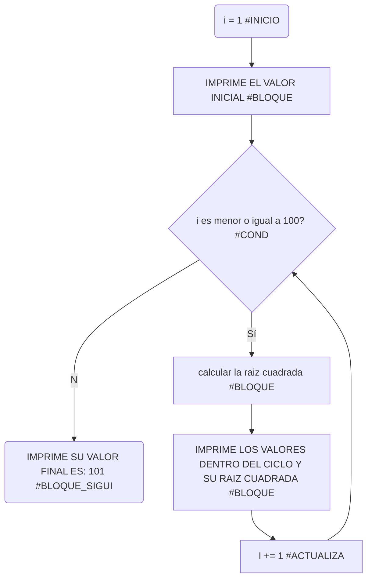
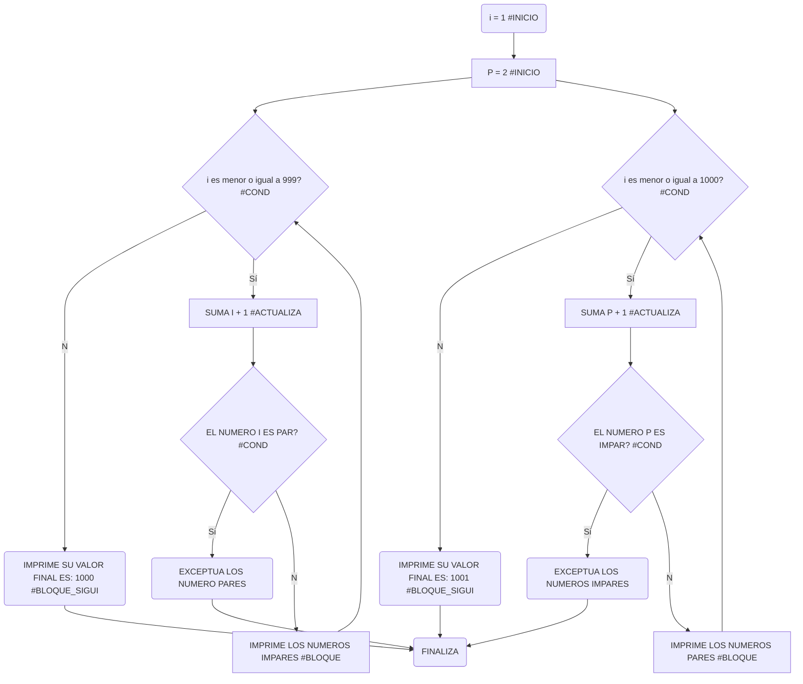

# RETO_7_UN_VIAJE_ASTRAL

## BUCLES 1

1. Imprimir un listado con los números del 1 al 100 cada uno con su respectivo cuadrado.

```pseudocode
i: int = 1 #<inicia>
print("el valor de i antes del ciclo: " + str(i))
while(i <= 100): #<cond>
    cuadrado = i ** 2 #<bloque>
    print("el valor dentro del ciclo: " + str(i)+ "y su cuadrado: " + str(cuadrado))
    i += 1 #<actualizada>
print("valor final de i: " + str(i))
```

[](https://postimg.cc/XpJx3vSy)



2. Imprimir un listado con los números impares desde 1 hasta 999 y seguidamente otro listado con los números pares desde 2 hasta 1000.

```pseudocode
i:int = 1 #<inicia> inicia el listado de los numeros impares
print("el valor i antes del ciclo: " + str(i)) #<bloque> imprime el valor inicial de i 
p:int = 2 #<inicia> inicia el listado de los numeros pares
print("el valor p antes del ciclo: " + str(p)) #<bloque> imprime el valor inicial de i
while (i <= 999):  #<cond> se repiten los numeros que sean menores o iguales a 999
    i += 1 #<actualiza> suma i + 1     
    if i%2 == 0: #<bloque> exceptua los numero pares
        continue
    print("el valor i en el ciclo es: " + str(i)) #<bloque> imprime el valor de i
while (p <= 1000): #<cond> se repiten los numeros que sean menores o iguales a 1000
    p += 1 #<actualiza> suma p + 1 
    if p%2 != 0: #<bloque> exceptua los numero impares
        continue
    print("el valor en el ciclo es: " + str(p)) #<bloque> imprime el valor de p

```
[](https://postimg.cc/9rmgPS05)


3. Imprimir los números pares en forma descendente hasta 2 que son menores o iguales a un número natural n ≥ 2 dado
